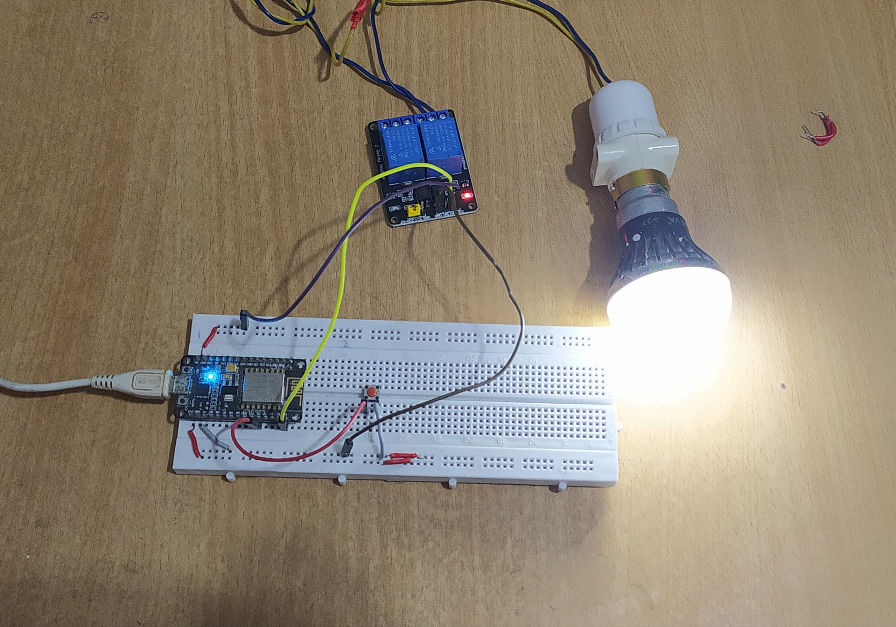
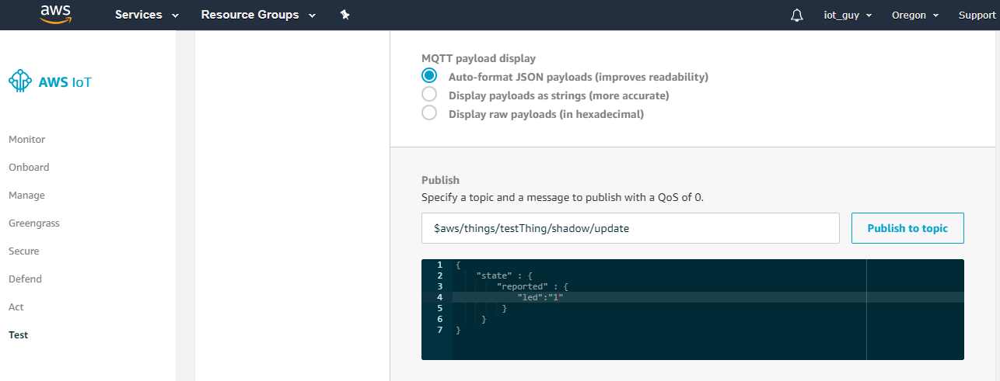

# Getting Started with AWS IoT Core

## YOUTUBE TUTORIAL LINKS

1. Configuring the AWS Thing | Introduction (PART 1):- https://youtu.be/NgESP53zceg
2. Circuit Diagram and Arduino Code Explained (PART 2):- https://youtu.be/tDehzSIK2YM
3. Restful api from Postman & Configuring AWS SNS (PART 3):- Uploaded Soon!

- PPT USED DURING THE SESSION:- aws.pptx
- Steps to configure AWS IoT Thing:- doc/README.md

## CODE WITH DESCRIPTION

1. Arduino/aws_esp_pubsub/aws_esp_pubsub.ino -> Arduino code for connecting with AWS IoT using pubsub Mqtt library.

2. Python/paho_test.py -> Python code for connecting with AWS IoT using Paho Mqtt library.

3. Python/sdk_test.js -> Javascript code for connecting with AWS IoT using aws-iot-device-sdk-js Mqtt library.

## CIRCUIT DIAGRAM

## Architecture with ThingShadow Topics

## IOT SETUP

## AWS Mqtt Client SS

## LINK FOR WRITTEN BLOG

